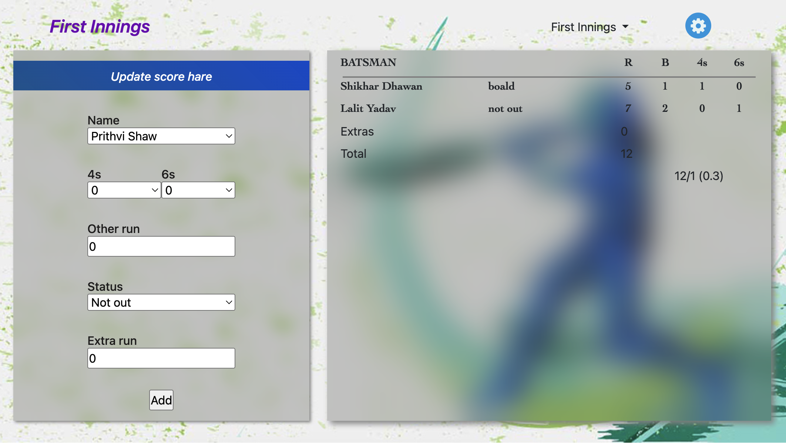
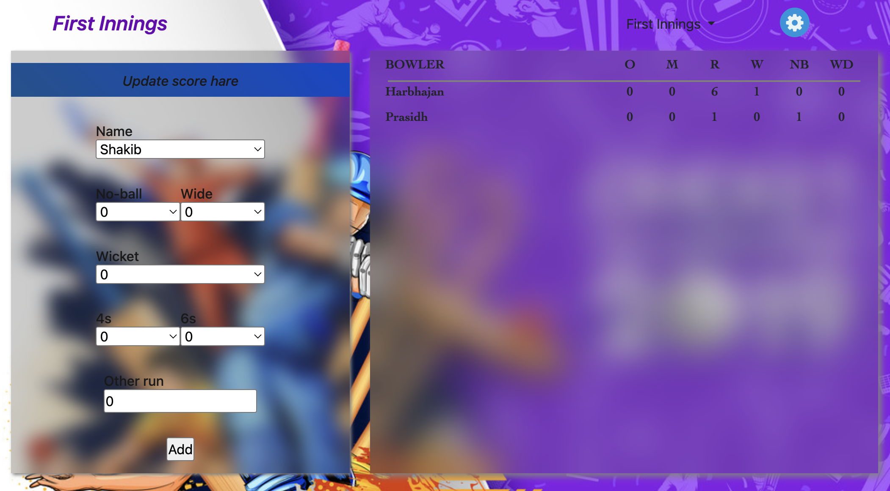

# Live Score Board

A web-based cricket live scoring application that allows admins to manage and operate live match scores, while users can follow real-time match updates, schedules, rankings, news, and archives.

## Features

- **Live Score Tracking** — Real-time batting and bowling scorecards for both innings
- **Match Schedule** — View upcoming and ongoing matches
- **Rankings** — Team and player rankings
- **News** — Cricket news section
- **Archives** — Historical match records
- **Admin Panel** — Secure admin interface to:
  - Operate live batting and bowling scores (both innings)
  - Add and manage match schedules
  - Post news articles

## Project Structure

```
Live-Score-Board/
├── index.html                  # Home / live score page
├── style/
│   ├── index.css
│   └── login.css
├── js/
│   ├── index.js
│   └── login.js
├── pages/
│   ├── Schedule/               # Match schedule page
│   ├── Ranking/                # Rankings page
│   ├── News/                   # News page
│   ├── Archivs/                # Archives page
│   └── Admin/                  # Admin panel
│       ├── adminhome.html
│       ├── cricket/            # Live score operation
│       │   ├── OperateBatting/ # Batting scorecard (1st & 2nd innings)
│       │   └── OperateBowling/ # Bowling scorecard (1st & 2nd innings)
│       ├── addSchedule/        # Add match schedule
│       └── addNews/            # Add news
└── images/                     # All image assets
```

## Tech Stack

- **HTML5 / CSS3** — Structure and styling
- **JavaScript / jQuery** — Client-side interactivity
- **Bootstrap 3** — Responsive layout
- **Font Awesome 4** — Icons

## Getting Started

No build step required. Open `index.html` directly in a browser, or serve the project with any static file server:

```bash
# Using Python
python3 -m http.server 8000

# Using Node.js (npx)
npx serve .
```

Then open `http://localhost:8000` in your browser.

## Admin Access

Navigate to `pages/Admin/adminhome.html` to access the admin panel for managing live scores, schedules, and news.

| Field    | Value     |
|----------|-----------|
| Username | `susanta` |
| Password | `123`     |

### Operate Options

#### 1. Batting Scorecard (`OperateBatting`)

Update a batsman's score ball by ball during a live match.

| Field      | Description                              |
|------------|------------------------------------------|
| Name       | Select the batsman from the dropdown     |
| 4s         | Number of fours hit in this delivery     |
| 6s         | Number of sixes hit in this delivery     |
| Other run  | Runs scored other than boundaries        |
| Status     | Batsman status — `Not out` or `Out`      |
| Extra run  | Extra runs (byes, leg byes, etc.)        |

Click **Add** to update the live batting scorecard on the right panel, which shows each batsman's Runs (R), Balls (B), 4s, and 6s, along with Extras and Total score.



---

#### 2. Bowling Scorecard (`OperateBowling`)

Update a bowler's figures over by over during a live match.

| Field    | Description                              |
|----------|------------------------------------------|
| Name     | Select the bowler from the dropdown      |
| No-ball  | Number of no-balls bowled                |
| Wide     | Number of wides bowled                   |
| Wicket   | Number of wickets taken                  |
| 4s       | Fours conceded                           |
| 6s       | Sixes conceded                           |
| Other run| Runs conceded other than boundaries      |

Click **Add** to update the live bowling scorecard on the right panel, which shows each bowler's Overs (O), Maidens (M), Runs (R), Wickets (W), No-balls (NB), and Wides (WD).



---

Both operate pages support **First Innings** and **Second Innings**, switchable from the dropdown in the top-right corner.
